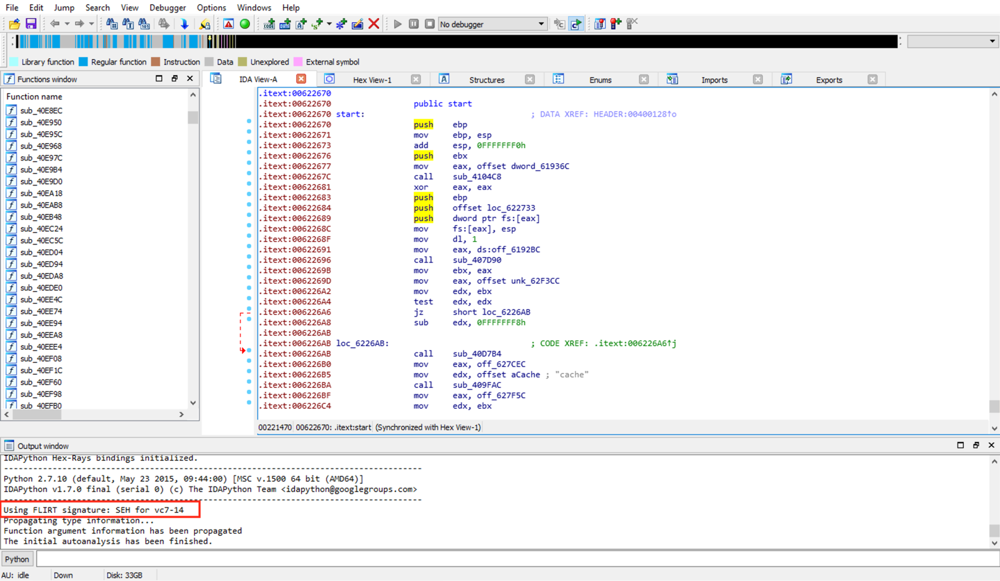
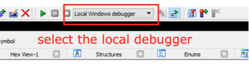
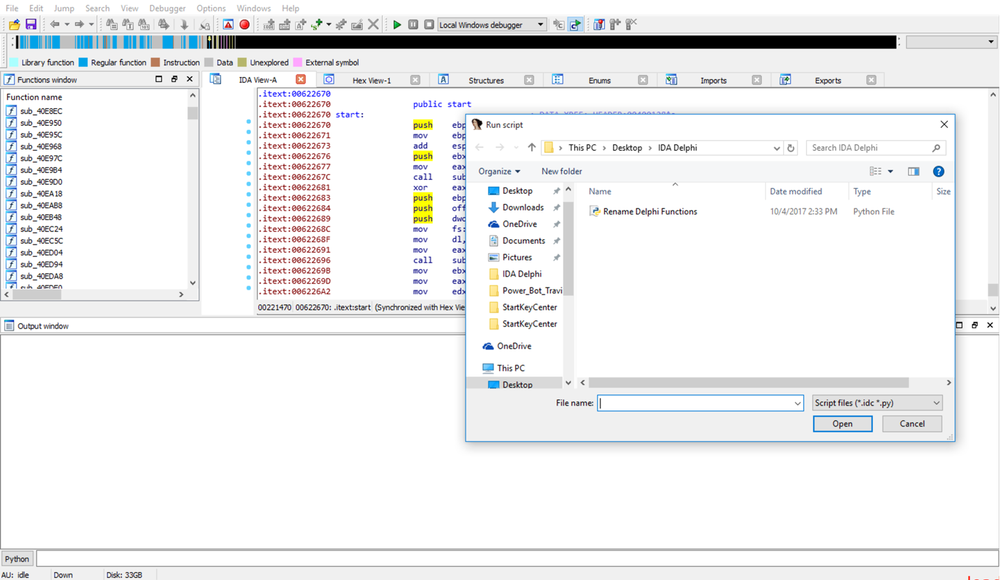
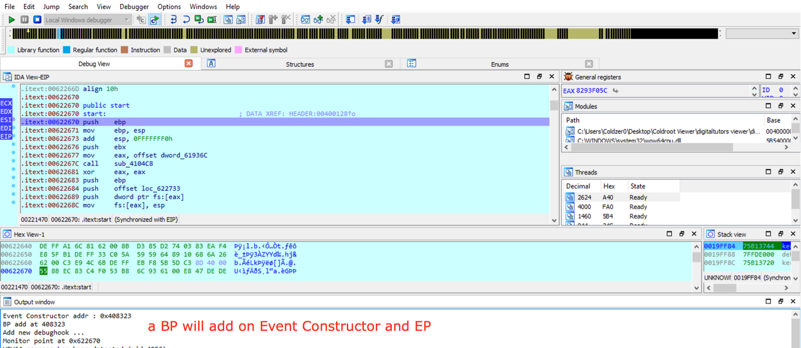
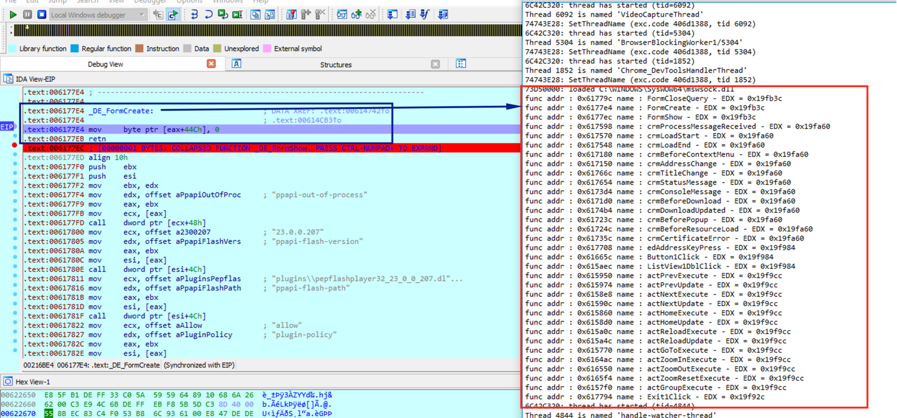
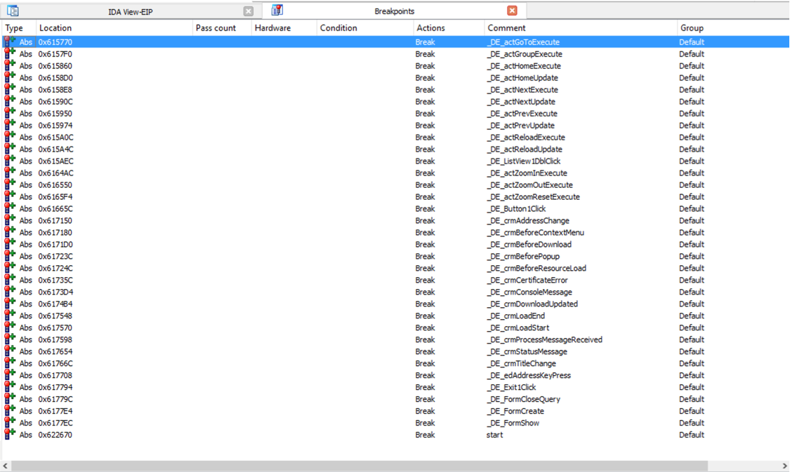

# IDA-For-Delphi

## IDA Python Script to Get All function names from Event Constructor 

### + at first IDA didn't recognise it as Delphi file

### + now select the local debugger

### + then load the script file

### + it will load and Stop at EP

### + hit the Greeeen button or [F9] :p

### + now we have all the Functions named and have a BP [on] 

## the only issue here is it needs to run the file & the file to be unpacked :confused:

## but if u can get the pattern address on unpacked file on memory it will work fine .

# Peace 
